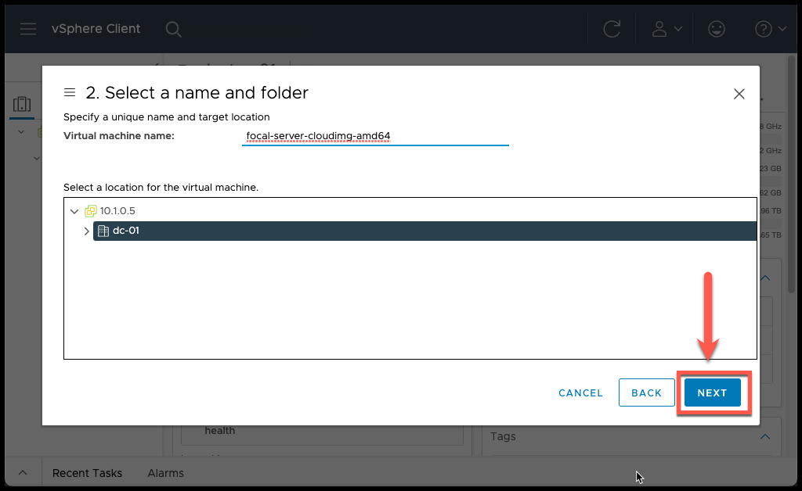
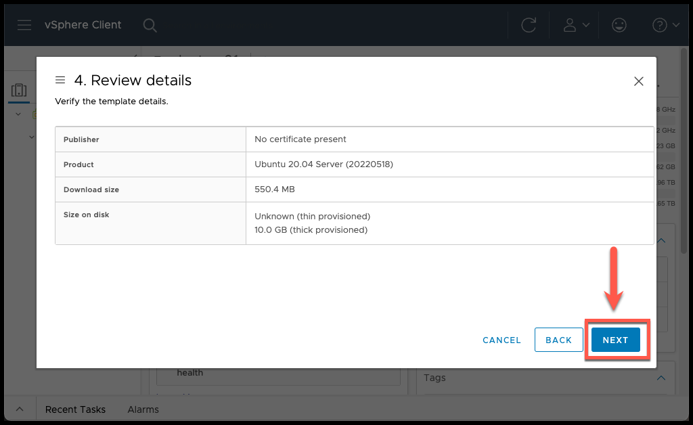

# Manual steps to import ubuntu cloud-image

[Link ubuntu cloud-images](https://cloud-images.ubuntu.com/)

- import OVA
    - select cluster
    - `ACTIONS` > `Deploy OVF Template...`

- add OVA template
    - paste the [URL](https://cloud-images.ubuntu.com/focal/current/focal-server-cloudimg-amd64.ova) of the .ova and click next

- name and folder
    - select the cluster
    - leave vm name as it is
    - click next

- compute resource
    - select the cluster
    - click next

- review details
    - click next

- storage
    - select storage

- network
    - leave the default `VM Network`
    - click next

- customize template
    - leave the defaults
    - click next

- ready to complete
    - review and click finish

- check that the VM is ready
    - click on cluster > VMs

