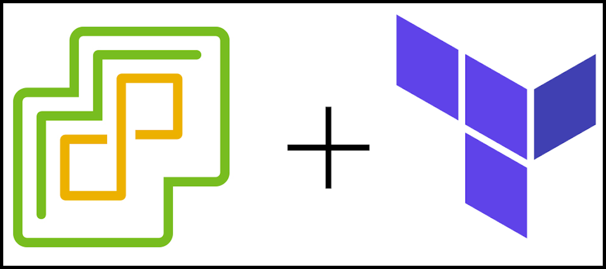

# vmware vpshere
- examples on how to create resources with terraform and [VMware vShere provider](https://registry.terraform.io/providers/hashicorp/vsphere/latest).



# How to use this repo
- clone the repo
```
git clone git@github.com:ion-onboarding/nomad-vmware.git
```

- change directory
```
cd nomad-vmware
```

- change directory into specific example directory
- follow instructions from README.md in that specific example
